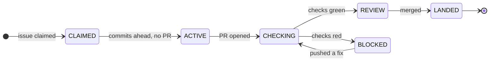

# orch

**Orchestration for fleets of AI coding agents.** Spawns Claude Code sessions in
isolated git worktrees, holds work-leases so two agents never touch the same
issue, gates completion on verified check output rather than an agent's own
report, and gives you one surface to stop, start, or restart any of them.

Python, ~1860 tests. Built and run daily against real repositories.

**Why it exists:** an agent will tell you it is done when it is not. orch treats
an agent as a clamped function — bounded input, bounded output, and a
verification gate in front of "done" — instead of trusting the claim.

---

A tracker for Claude Code sessions doing work across repos, with controls to
stop, start, and restart any of them from any surface. It is not an
automator: it does not decide what work is worth doing. It shows you
everything and lets you act. Judgment lives in agents that hold context;
orch supplies mechanics — spawn, lease, wake, record — and never learns what
a repo means.

Full design: [`DESIGN.md`](DESIGN.md). State-machine audit: `STATES.md`.
The `/sc` seam workers run through: [`docs/SC-INTERFACE.md`](docs/SC-INTERFACE.md).
This file is the front door, not a substitute for any of the three.

## How the work moves

Two independent state functions, both pure and both derived from what the forge
actually reports — never from an agent's claim about itself. Transcribed from
[`STATES.md`](STATES.md), which is audited against `core.py`.



`work_state(world, repo, n)` resolves first-match-wins:

    PR MERGED               -> LANDED
    PR OPEN & green         -> REVIEW
    PR OPEN & red           -> BLOCKED
    PR OPEN & not green/red -> CHECKING
    no PR & commits ahead   -> ACTIVE
    no PR & no commits      -> CLAIMED

Liveness is a separate axis on purpose. `alive(key)` reads the session ledger
and checks whether the recorded pgid still exists; it never feeds `work_state`.
State is about the work, liveness is about the actor. An agent dying does not
move the work backwards, and an agent insisting it is finished does not move it
forwards.

## Usage

```
$ spawn.py --help
usage: echo "<brief>" | spawn.py <role> <scope...> [--fresh]

  spawn.py dashboard-op
  spawn.py repo-orch <slug>
  spawn.py issue-orch <slug> <n>

  --fresh                      # start cold: ignore the key's transcript and
                               # do not --resume. Use when you judge the prior
                               # conversation spent (context exhausted, or it
                               # died confused). Default resumes.

  spawn.py kill <key>          # e.g. issue-orch.slug.42
  spawn.py tick                # one pulse now
  spawn.py status [key|slug]   # public/status.json, one ledger row, or one repo's row
  spawn.py tail <key> [n]      # last n lines of that key's run log (default 40)
  spawn.py watch <path>        # add a git repo to repos.txt
  spawn.py unwatch <path>      # remove it
```

Roles are markdown contracts in [`agents/`](agents/), not code: `worker.md`
builds, `reviewer.md` reviews, `issue-orch.md` drives one issue end to end.
Workers cannot run `git` or `gh` at all — the merge decision never belongs to
the thing that wrote the code.


## Before you point this at a real repo

**Workers never merge — they cannot run git or gh at all.** The merge
decision belongs to issue-orch's landing phase, not to any worker.

**`auto-land` merges unattended, and the review is the only gate.** With
`auto-land` set, a PR is reviewed and then merged with no human in the loop.
A failing check still stops it (`pr_green`), but the **absence** of CI does
not: an empty rollup is green and merges. On a repo with no CI the agent
review IS the whole verification step — which is why the review is mandatory
under `auto-land`, not why it is skipped. A blocking review finding holds
the merge for you without touching `auto-land` or any other label
(orch#408, ruling orch#148 option B).

Read that plainly: on a repo with no CI, nothing but an agent's review stands
between a change and `main`. See
[`docs/SC-INTERFACE.md`](docs/SC-INTERFACE.md) for how the issue pipeline
replaced the old `/sc` seam.

## What it is

The tick is the pulse, not a level. Below it sit three spawned
supervision levels, each spawning the one below it:

    tick             dumb. derive the world, rebuild the dashboard, gate the wake.
      dashboard-op   machine-wide. which repos have conditions. spawns repo-orch.
        repo-orch    one per repo. where repo understanding lives. spawns issue-orch.
          issue-orch one per issue. drives it through workers.

A worker is not a spawned session: it is an Agent-tool subagent of
issue-orch, sharing its pgid and permission envelope, driven by
`agents/worker.md` as a prompt template. It has no key and no run log.

Keys: `dashboard-op`, `repo-orch.<slug>`, `issue-orch.<slug>.<n>`.
Cardinality (one dashboard-op, one repo-orch per repo, one issue-orch per
issue) is enforced by a flock on the key, not by application logic.

State is derived fresh every tick from GitHub labels, PR status, and git
timestamps — never stored. A session dying costs only conversation, never
progress: commits, the pushed branch, and the issue journal (GitHub issue
comments) all survive it. See DESIGN.md's "Derived versus recorded" and
"How the acceptance test passes" for the full argument.

## Install / run

Python package `orch/`. No bash. Runs on macOS and Linux.

Requires: `gh` (authenticated), `claude` on PATH, `python3`. No `jq`, no
systemd.

    cp repos.example.txt repos.txt   # machine-local, gitignored — see DEPLOY.md
    $EDITOR repos.txt      # one repo path per line, # comments, ~ expands
    ./run.py

`run.py` starts the server and the ticker (two processes; the ticker's
cadence defaults to 60s, override with `ORCH_TICK_SECS`, and `--no-tick`
starts the dashboard alone), and opens a chromeless Chrome
app-mode window at the dashboard — falling back to a plain browser tab if no
Chromium-family browser is found. `./run.py --fg` keeps the server in the
foreground; `--no-open` skips the window.

**Deployment is documented in `DEPLOY.md`** — the timer/hook/service chain,
how to operate it, and what each refusal means.

On a machine where orch runs continuously, the server is managed by systemd
rather than started by hand. On devhost that is the user unit
`orch-web.service` (`Restart=always`, so it comes back from any exit):

    systemctl --user restart orch-web     # restart it
    systemctl --user status orch-web      # is it running, and since when

Do NOT restart it with `nohup python3 -m orch.server &`. A hand-started copy
is a child of the invoking shell and dies with it, and killing the managed
process to make room for one takes the dashboard down until somebody
notices. That happened on 2026-09-13; see issue #86.

The tick runs as a **second service**, `orch-tick.service`
(`python3 -m orch.ticker`). Ticking is what spends tokens — it spawns agent
sessions — and the dashboard only displays state, so they are separable:

    systemctl --user stop orch-tick       # stop spending, keep the dashboard

Bundled in one process there was no way to do that without also going blind
(issue #442). The dashboard's tick button still fires a one-shot tick while
the service is stopped.

`orch-tick.timer` also exists on devhost and is deliberately **disabled**: the
ticker runs its own loop, so the timer would be a second competing cadence.

## The terminal view

    python3 -m orch.tui

A full-screen terminal view of the same tree the web dashboard shows, in the
shape of `tig`.

It reads `public/status.json` from disk, not over HTTP. It therefore works
when `orch-web.service` is stopped — which is exactly when an operator most
wants to look. That is the point of the tool.

It refreshes on `r`, never on a timer. The tick is the origin of state. A TUI
that polls on its own cadence competes with it.

    j / k / arrows   move
    Enter            expand or collapse the selected row
    q                go back; quit at the top level
    Q                quit immediately
    r                refresh from disk
    t                tail the selected session's transcript
    g / G            jump to the top or the bottom
    ?                show all keys

Action keys also exist. Press `?` for the full list.

`--feed <path>` points it at another feed file.

There is no new dependency: `curses` is in the standard library.

`repos.txt` is a bare path list, machine-local by design — it says where a
watched repo lives on this machine, and never travels with the repo itself.
It does not ship with the repo; copy `repos.example.txt` to create it
(orch#250).
A watched repo can also carry its own `auto-land` default, nested in its
entry in `ORCH_HOME/orch.json` (orch#297) — same file as `repos.txt`'s
replacement, so unlike the old `.orch.toml` this setting is now
machine-local like `repos.txt` itself, not versioned with the repo. It used
to travel with the repo's own clone; it no longer does, on the same
per-machine logic that makes `repos.txt` machine-local:

    { "repos": [ { "path": "/home/user/orch", "state": "tracked",
                   "auto-land": true } ] }

That is an example, not a default — each repo sets its own, and a key left
out reads as off. This repo's own entry in `orch.json` is the live one.

One flag: `auto-land` means automatically review, then merge. A clean
review merges unattended; a blocking finding holds the merge instead — the
hold is derived fresh from the PR's own `orch:review:v1` block at merge
time, not a label write, so `auto-land` stays exactly as the operator set
it (orch#408, ruling orch#148 option B). The work state stays `REVIEW`, and
automation stops merging it until a fresh clean re-review posts a new
block; pushing a fix alone does not lift the hold. repo-orch
reads the repo default and passes it into the issue-orch brief; a per-issue
`auto-land` / `no-auto-land` label overrides the repo default in either
direction. See `agents/repo-orch.md` and
`agents/skills/issue-landing/SKILL.md` for the precedence rule.

Storage moved here, off `.orch.toml` and into `orch.json`, by orch#297. The
key itself is still named `auto-land`; a further rename to a single
`automerge` key is proposed in `docs/UX-REDESIGN.md` §4.1 and §6 but not yet
implemented (orch#212) — do not read this section as though that rename has
already happened.

An absent or empty CI check rollup reads as green, in the state display and
at the merge gate alike — deliberate, and unchanged by the one-flag work.
CI presence is not a condition on `auto-land` (operator verdict,
2026-09-14): a repo with no CI is reviewed and then merged. `core.pr_verified`
still answers "did anything actually run", but nothing gates on it.

## Issue state

Pure over GitHub labels, first match wins:

    agent-stuck        → ABANDONED
    ¬agent-working      → UNCLAIMED
    else                → CLAIMED

## Unit state

First match wins:

    PR MERGED               → LANDED
    PR OPEN ∧ green         → REVIEW
    PR OPEN ∧ red           → BLOCKED
    PR OPEN ∧ ¬green ∧ ¬red → CHECKING
    ¬PR ∧ commits ahead     → ACTIVE
    ¬PR ∧ ¬commits          → CLAIMED

Forward path (documentation only — backwards edges are legal and
self-correcting):

    UNCLAIMED → CLAIMED → ACTIVE → CHECKING → REVIEW → LANDED
                                       ↕
                                    BLOCKED

Liveness (`killpg` on the ledger row's pgid) is a third, orthogonal axis —
not part of either state function. There is deliberately no STALE state:
staleness is a conclusion, and conclusions belong to whoever holds context.

## Labels

    agent-ready      queued for pickup; cleared when issue-orch claims
    agent-working    claimed (issue-orch owns this exclusively); cleared when the issue lands
    agent-stuck      needs a human: an agent gave up, or filed this
    auto-land        issue-orch may review, then merge without asking;
                      a blocking review finding holds the merge without
                      touching this label
    no-auto-land     opts an issue out of a repo-wide auto-land default

## The CLI

The session verbs are shared between the CLI and `/act`, but the two
surfaces diverge, and the split is an oversight rather than a design
(ruled on #223) — so it closes verb by verb, on demand, never
speculatively.

The issue-management verbs have CLI forms as of #223: `issue create`,
`issue comment`, `issue close`, `issue label-add` and `issue
label-remove` cover the `create_issue` and `reply` actions and the
label writes. Each is a thin passthrough over `RepoAdapter`, so the
caller names the action and orch picks `gh` or `tea` — the point of the
wrapper is that no agent has to remember which backend a repo uses.

Still HTTP-only: `assign` (deferred — its whole job is writing
`agent-ready`, which #346 is ruled to collapse), `set_auto_land`,
`unclaim`, `review_now`, `approve_item`, `reject_item`, and the four
diagnostics `probe`, `candidates`, `log`, `untracked`. `merge` is
deliberately CLI-only-by-a-different-path and stays outside the
`issue` group: it must respect `auto-land`, and absent CI reads as
green, so a second unconditional merge path would be unsafe.

Going the other way, `journal`, `names` and `status` have no HTTP
action. The brief goes on stdin.

    echo "<brief>" | spawn.py <role> <scope...>

    spawn.py dashboard-op
    spawn.py repo-orch <slug>
    spawn.py issue-orch <slug> <n>

    spawn.py kill <key>          # e.g. issue-orch.slug.42
    spawn.py tick                # one pulse now
    spawn.py status [key]        # public/status.json, or one ledger row
    spawn.py tail <key> [n]      # last n lines of that key's run log (default 40);
                                 # fills in while the session runs, not just at exit
    spawn.py watch <path>        # add a git repo to repos.txt
    spawn.py unwatch <path>      # remove it

This is the agent's operator surface: an orchestrator acts on its own tree
through Bash, calling `spawn.py` exactly as the operator would from a
terminal.

## Surfaces

| surface | for |
|---|---|
| `public/widget.html` (served by `server.py`, opened by `run.py`) | full tree, controls |
| `:18803/widget.html` | same, over the tailnet |
| `spawn.py` | CLI — agent's and operator's action surface |
| `history.jsonl` | append-only record of what each tick saw |
| GitHub issue threads | per-issue journal and steering, any device |
| transcripts + `state/sessions/<key>.log` | what an agent actually did |

## Further reading

- `DESIGN.md` — the whole design: state machine, addressing, the ledger,
  spawn semantics, the tick's nine wake conditions, journals, the worker/`/sc`
  contract, failure and recovery paths, the security model, and the cut
  list (what was considered and rejected, and why it stays cut).
- `STATES.md` — state-machine audit.
- `docs/SC-INTERFACE.md` — the `/sc` seam: what orch hands a worker, and all
  six mismatches between what `/sc` does natively and what orch needs.
</content>
